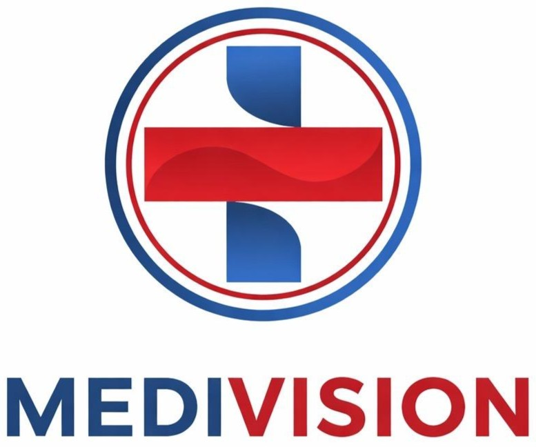
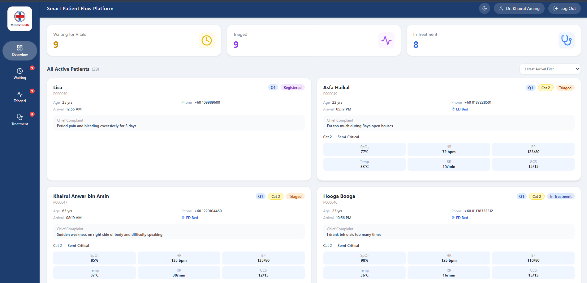
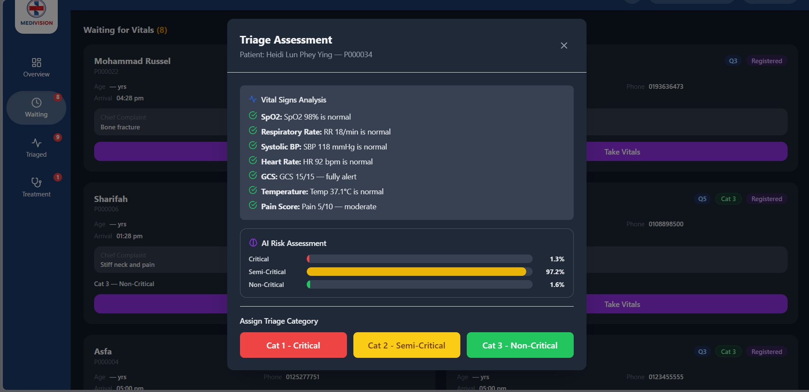
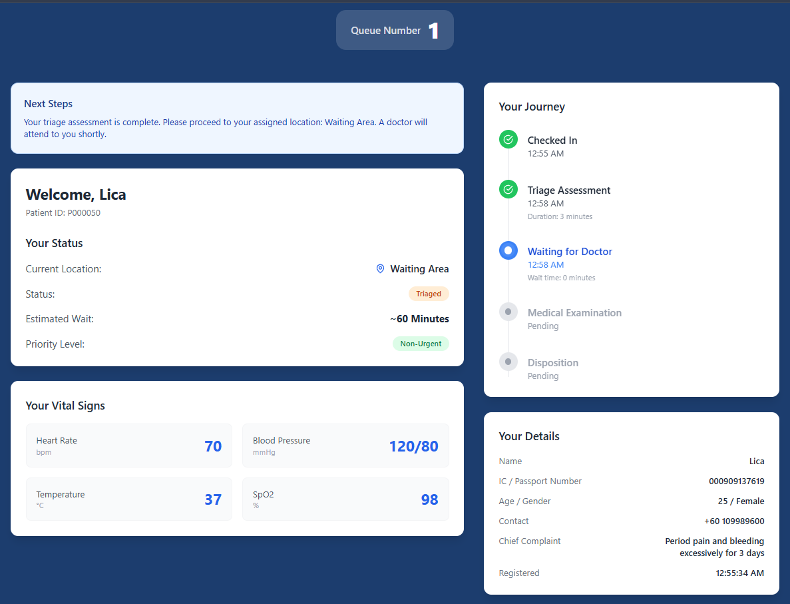
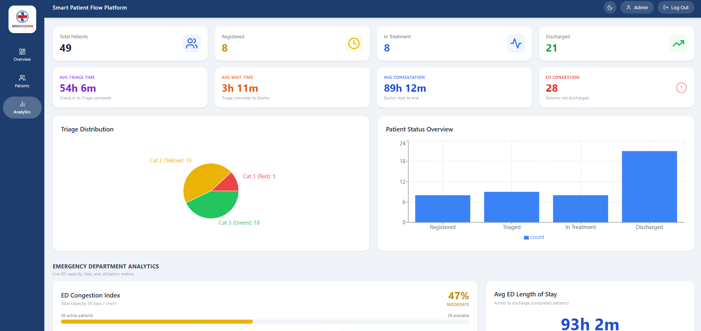

<p align="center">
  
</p>

<h1 align="center">🏥 MediVision</h1>
<h3 align="center">Smart Patient Flow Platform</h3>
<p align="center"><em>Real-time insights for smarter emergency care</em></p>

<div align="center">

> Web-based Emergency Department platform built around a machine-learning triage classifier, with real-time patient tracking and visual analytics.

[](https://medivision-dashboard.vercel.app)
[](https://youtu.be/a-wKaxb9S9o)

</div>

---

## 🎬 Demo

[](https://youtu.be/a-wKaxb9S9o)

## 📸 Screenshots

| Dashboard | AI Triage |
|-----------|-----------|
|  |  |

| Patient Tracking | Analytics |
|------------------|-----------|
|  |  |

---

## ✨ Features

- **AI-powered triage**: An XGBoost classifier predicts patient severity at intake, with mandatory nurse review and full override logging so clinical staff always retain control.
- **Real-time patient tracking**: Live status updates across the patient pathway using Socket.io, with no page refresh required.
- **Visual analytics dashboard**: Interactive charts for department load, wait times and patient flow built with Recharts.
- **Role-based access control**: JWT-authenticated logins with distinct permissions for different clinical roles.
- **Responsive UI**: Clean and accessible interface designed for clinical environments.

---

## 🧠 Machine Learning

The core of MediVision is a triage classifier that predicts emergency patient severity from intake data (vital signs and symptoms), supporting nurses with a data-driven category recommendation.

**Model**
- **Algorithm:** XGBoost, chosen over simpler baselines (e.g. logistic regression) for its handling of non-linear feature interactions and tabular clinical data.
- **Pipeline:** Built in Python with scikit-learn and XGBoost. Feature encoders and the trained model are persisted with `joblib` to guarantee identical encoding at training and inference time.
- **Serving:** Deployed as a standalone FastAPI microservice, decoupled from the main application so the model can be retrained and redeployed independently. The Express backend calls it over HTTP for each triage prediction.

**ML lifecycle covered**
- Data preprocessing and consistent feature encoding (train/inference parity)
- Model training, evaluation, and selection
- Packaging and deployment of the model behind a REST API
- Integration into a production application with a human-in-the-loop safeguard

**Human-in-the-loop design**
- The model produces a *recommendation*, never a final decision. Nurses must review and can override every prediction, and all overrides are logged. This keeps the AI assistive rather than authoritative.

---

## 🛠️ Tech Stack

**Machine Learning Service**
- Python + FastAPI
- XGBoost + scikit-learn (triage classifier)
- joblib (model + encoder persistence)

**Frontend**
- React + Vite
- Tailwind CSS
- Recharts
- Socket.io client

**Backend**
- Node.js + Express.js
- JWT authentication + RBAC
- Socket.io

**Database**
- MongoDB Atlas + Mongoose

**Deployment**
- Vercel (frontend)
- Render (backend + ML service)
- MongoDB Atlas (database)

---

## 🏗️ Architecture

MediVision uses a three-tier architecture with a dedicated ML microservice:

```
React (Vercel)  ──>  Express API (Render)  ──>  MongoDB Atlas
│
└──>  FastAPI ML Service (Render)  ──>  XGBoost model
```

The React client communicates with the Express API over REST and Socket.io. The Express layer handles authentication, business logic, and persistence, and delegates triage prediction to a separate FastAPI microservice. Keeping the ML service independent allows the model to be retrained and redeployed without touching the core application.

---

## 📁 Project Structure

```
medivision-dashboard/

├── frontend/      # React + Vite client
├── backend/       # Express API + Socket.io
├── ai-service/    # FastAPI XGBoost triage service
└── .github/       # CI / repo configuration
```

---

## 👥 Team

Built by a team of five students at Taylor's University:

- Syahmi Shamsul ([sabinshamsul](https://github.com/sabinshamsul)) - Project Manager, Backend & ML Service Integration
- Jerry Wingsky ([JerryWingsky](https://github.com/JerryWingsky)) - UI/UX & Backend
- Kelvin ([kelvin-0805](https://github.com/kelvin-0805)) - Database & Backend
- Asfa Haikal ([AsfaHaikal1](https://github.com/AsfaHaikal1)) - Frontend & Backend
- Muhammad Hasri ([HasriDez](https://github.com/HasriDez)) - AI & Data Analytics

Supervised by Dr. Soobia Saeed

---

## 📄 License

This project was developed for academic purposes as part of a final-year Capstone Project.